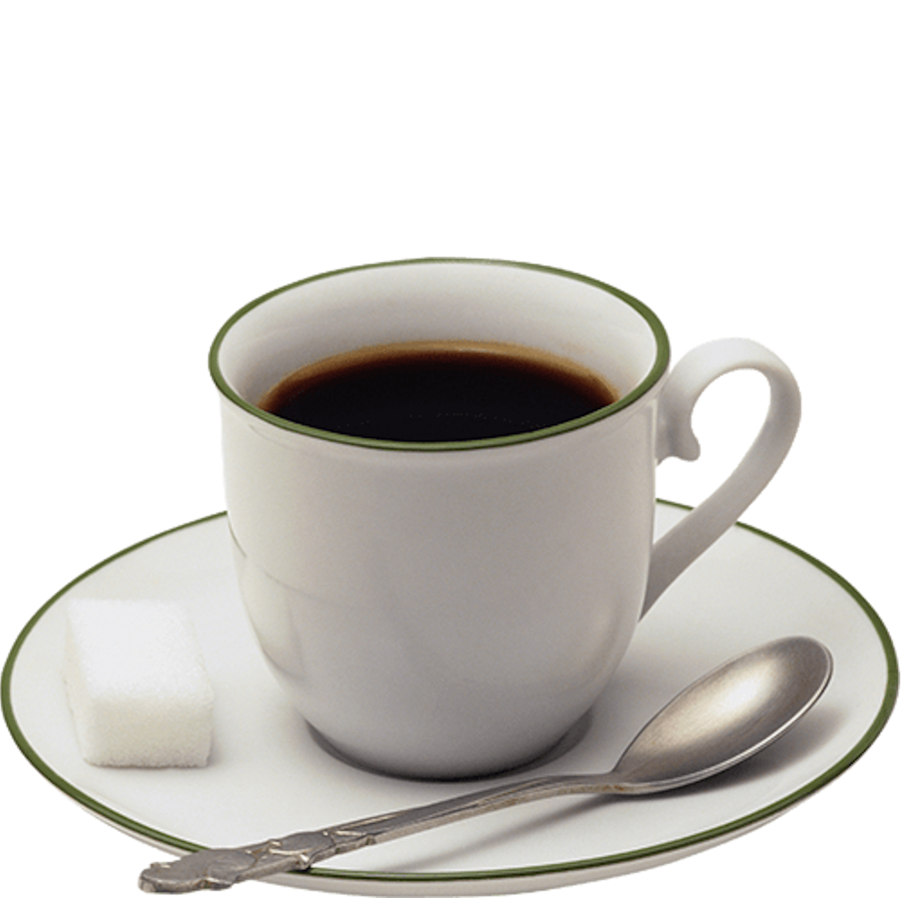

# jose.github.io

   
<a>
 <ul>

    <a href="https://www.youtube.com/watch?v=dQw4w9WgXcQ">
        <h2>Café clásico</h2>
        
    

    

        <h2>Café con azucarada</h2>
        <a href="https://www.youtube.com/watch?v=dQw4w9WgXcQ">
            
    

    

        <h2>Café con chocolate</h2>
        <a href="https://www.youtube.com/watch?v=dQw4w9WgXcQ">
            
        

  </ul>           
 </a> 

